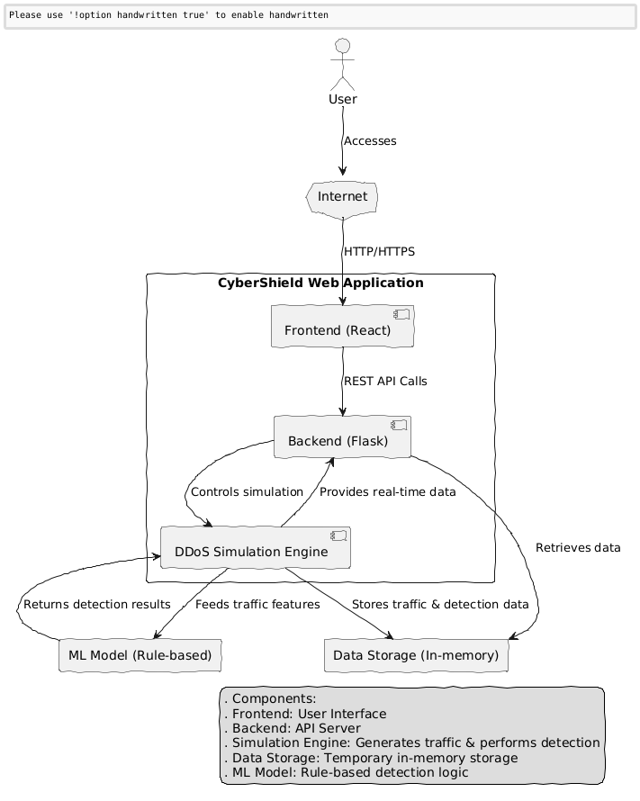

# CyberShield - DDoS Detection & Mitigation Demo

## Complete Documentation

### Table of Contents
1. [Project Overview](#project-overview)
2. [Architecture](#architecture)
3. [Installation & Setup](#installation--setup)
4. [API Documentation](#api-documentation)
5. [Frontend Components](#frontend-components)
6. [Backend Implementation](#backend-implementation)
7. [How It Works](#how-it-works)
8. [Deployment](#deployment)
9. [Source Code Structure](#source-code-structure)

---

## Project Overview

CyberShield is a comprehensive web application that demonstrates DDoS (Distributed Denial of Service) attack detection and mitigation capabilities. It provides an interactive simulation environment for cybersecurity education and demonstration purposes.

### Key Features
- **Real-time Traffic Monitoring**: Live visualization of network traffic patterns
- **DDoS Attack Simulation**: Multiple attack types (SYN Flood, UDP Flood, HTTP Flood)
- **ML-based Detection**: Rule-based classification system simulating machine learning detection
- **Interactive Dashboard**: Professional cybersecurity-themed interface
- **Traffic Analysis**: Distribution charts and feature importance visualization
- **Security Alerts**: Real-time notifications and status tracking

---

## Architecture

### Frontend (React)
- **Framework**: React 18 with Vite
- **UI Library**: Tailwind CSS + shadcn/ui components
- **Charts**: Recharts for data visualization
- **Icons**: Lucide React icons
- **State Management**: React hooks (useState, useEffect)

### Backend (Flask)
- **Framework**: Flask (Python)
- **API**: RESTful endpoints
- **Real-time Updates**: Threading for background simulation
- **CORS**: Enabled for frontend-backend communication
- **ML Simulation**: Rule-based classification system

### Data Flow
```
Frontend (React) ←→ REST API ←→ Backend (Flask) ←→ Simulation Engine
```

---

## Installation & Setup

### Prerequisites
- Node.js 18+ and pnpm
- Python 3.11+
- Git

### Backend Setup
```bash
cd cybershield-backend
python -m venv venv
source venv/bin/activate  # On Windows: venv\Scripts\activate
pip install -r requirements.txt
python src/main.py
```

### Frontend Setup
```bash
cd cybershield-frontend
pnpm install
pnpm run dev
```

### Production Build
```bash
# Frontend
cd cybershield-frontend
pnpm run build

# Copy to Flask static directory
cp -r dist/* ../cybershield-backend/src/static/
```

---

## API Documentation

### Base URL
- Development: `http://localhost:5000/api`
- Production: `https://qjh9iec5lgnz.manus.space/api`

### Endpoints

#### GET /ddos/status
Get current simulation status
```json
{
  "simulation_active": true,
  "data_points": 25,
  "last_update": "2025-07-21T12:30:45.123456"
}
```

#### POST /ddos/start
Start DDoS simulation
```json
// Request
{
  "attack_type": "syn_flood",  // null, "syn_flood", "udp_flood", "http_flood"
  "intensity": 1.5,
  "duration": 60
}

// Response
{
  "message": "Simulation started",
  "attack_type": "syn_flood",
  "intensity": 1.5,
  "duration": 60
}
```

#### POST /ddos/stop
Stop DDoS simulation
```json
{
  "message": "Simulation stopped"
}
```

#### GET /ddos/data
Get current traffic and detection data
```json
{
  "traffic_data": [
    {
      "timestamp": "2025-07-21T12:30:45.123456",
      "packet_rate": 850,
      "unique_ips": 12,
      "avg_packet_size": 64,
      "protocol_diversity": 0.2,
      "connection_rate": 180,
      "is_attack": true,
      "attack_type": "syn_flood"
    }
  ],
  "detection_results": [
    {
      "timestamp": "2025-07-21T12:30:45.123456",
      "is_attack": true,
      "confidence": 0.85,
      "attack_probability": 0.85
    }
  ]
}
```

#### POST /ddos/clear
Clear all simulation data
```json
{
  "message": "Data cleared"
}
```

#### GET /ddos/model-info
Get ML model information
```json
{
  "model_type": "Rule-based Classifier",
  "n_estimators": 1,
  "features": [
    "packet_rate",
    "unique_ips",
    "avg_packet_size",
    "protocol_diversity",
    "connection_rate"
  ],
  "feature_importance": [0.25, 0.20, 0.15, 0.20, 0.20]
}
```

---

## Frontend Components

### Main App Component (`App.jsx`)
The main React component that orchestrates the entire application:

```jsx
// Key state variables
const [simulationActive, setSimulationActive] = useState(false)
const [attackType, setAttackType] = useState('normal')
const [intensity, setIntensity] = useState(1)
const [activeTab, setActiveTab] = useState('traffic')
const [trafficData, setTrafficData] = useState([])
const [detectionData, setDetectionData] = useState([])
```

### Dashboard Tabs
1. **Traffic Tab**: Real-time traffic monitoring with line charts
2. **Detection Tab**: ML detection results with confidence visualization
3. **Analysis Tab**: Traffic distribution pie chart and feature importance
4. **ML Model Tab**: Model information and input features

### UI Components
- **Control Panel**: Simulation controls and configuration
- **Security Alerts**: Real-time alert notifications
- **Metrics Cards**: Key performance indicators
- **Charts**: Interactive data visualizations using Recharts

---

## Backend Implementation

### Main Flask Application (`main.py`)
```python
from flask import Flask, send_from_directory
from src.routes.ddos_simulation_simple import ddos_bp
from flask_cors import CORS

app = Flask(__name__, static_folder='static')
CORS(app)
app.register_blueprint(ddos_bp, url_prefix='/api/ddos')

@app.route('/')
def serve_frontend():
    return send_from_directory(app.static_folder, 'index.html')
```

### DDoS Simulation Engine (`ddos_simulation_simple.py`)
The core simulation logic includes:

#### Traffic Generation
```python
def generate_traffic_data(attack_type=None, intensity=1.0):
    if attack_type == 'syn_flood':
        packet_rate = random.randint(int(800 * intensity), int(1200 * intensity))
        unique_ips = random.randint(5, 15)
        avg_packet_size = random.randint(40, 80)
        protocol_diversity = random.uniform(0.1, 0.3)
        connection_rate = random.randint(int(150 * intensity), int(250 * intensity))
    # ... other attack types
```

#### ML Detection Algorithm
```python
def simple_ml_detection(traffic_features):
    packet_rate, unique_ips, avg_packet_size, protocol_diversity, connection_rate = traffic_features
    
    attack_score = 0
    
    # Rule-based scoring
    if packet_rate > 500:
        attack_score += 0.4
    if unique_ips < 20 and packet_rate > 200:
        attack_score += 0.3
    if avg_packet_size < 100:
        attack_score += 0.2
    if protocol_diversity < 0.4:
        attack_score += 0.2
    if connection_rate > 100:
        attack_score += 0.3
    
    attack_score = min(attack_score, 1.0)
    is_attack = attack_score > 0.5
    confidence = attack_score if is_attack else (1 - attack_score)
    
    return {
        'is_attack': is_attack,
        'confidence': confidence,
        'attack_probability': attack_score
    }
```

---

## How It Works

### 1. Simulation Engine
The simulation engine runs in a separate thread and generates realistic network traffic data:

- **Normal Traffic**: Moderate packet rates, diverse IPs, standard packet sizes
- **SYN Flood**: High packet rates, few unique IPs, small packet sizes
- **UDP Flood**: High packet rates, moderate IPs, small packets
- **HTTP Flood**: Moderate packet rates, varied IPs, medium packet sizes

### 2. Detection Algorithm
The ML detection system uses a rule-based approach that evaluates five key features:

1. **Packet Rate**: Packets per second
2. **Unique IPs**: Number of distinct source IP addresses
3. **Average Packet Size**: Mean size of network packets
4. **Protocol Diversity**: Variety of network protocols used
5. **Connection Rate**: New connections per second

### 3. Real-time Updates
- Frontend polls the backend every 2 seconds for new data
- Backend generates new data points every second during simulation
- Charts and metrics update automatically with smooth animations

### 4. Data Visualization
- **Line Charts**: Show traffic trends over time
- **Pie Charts**: Display traffic type distribution
- **Bar Charts**: Visualize feature importance
- **Metrics Cards**: Show current values with trend indicators

---

## Deployment

### Local Development
1. Start backend: `python src/main.py` (port 5000)
2. Start frontend: `pnpm run dev` (port 5173)
3. Access at `http://localhost:5173`

### Production Deployment
1. Build frontend: `pnpm run build`
2. Copy build to Flask static directory
3. Deploy Flask app to cloud platform
4. Access at production URL

### Environment Variables
```bash
FLASK_ENV=production
FLASK_DEBUG=False
```

---

## Source Code Structure

```
cybershield-project/
├── cybershield-backend/
│   ├── src/
│   │   ├── main.py                 # Flask application entry point
│   │   ├── models/
│   │   │   └── user.py            # Database models
│   │   ├── routes/
│   │   │   ├── user.py            # User routes
│   │   │   └── ddos_simulation_simple.py  # DDoS simulation API
│   │   └── static/                # Built frontend files
│   ├── requirements.txt           # Python dependencies
│   └── venv/                     # Virtual environment
│
├── cybershield-frontend/
│   ├── src/
│   │   ├── App.jsx               # Main React component
│   │   ├── App.css               # Application styles
│   │   ├── main.jsx              # React entry point
│   │   ├── components/
│   │   │   └── ui/               # shadcn/ui components
│   │   ├── hooks/
│   │   │   └── use-mobile.js     # Custom hooks
│   │   └── lib/
│   │       └── utils.js          # Utility functions
│   ├── package.json              # Node.js dependencies
│   ├── vite.config.js            # Vite configuration
│   ├── tailwind.config.js        # Tailwind CSS configuration
│   └── dist/                     # Built files
│
└── documentation/
    ├── DOCUMENTATION.md          # This file
    ├── deployment_summary.md     # Deployment summary
    └── project_summary.md        # Project overview
```

### Key Files Explained

#### `App.jsx` - Main React Component
Contains the entire frontend application logic including:
- State management for simulation data
- API calls to backend
- Tab navigation system
- Real-time data updates
- Chart rendering and interactions

#### `ddos_simulation_simple.py` - Backend API
Implements the complete DDoS simulation system:
- Traffic data generation
- ML detection algorithm
- RESTful API endpoints
- Threading for background simulation
- Data persistence and management

#### `main.py` - Flask Application
Sets up the Flask server with:
- CORS configuration
- API route registration
- Static file serving for frontend
- Production-ready configuration

---

## Technical Decisions

### Why React + Flask?
- **React**: Modern, component-based UI with excellent charting libraries
- **Flask**: Lightweight, flexible Python framework perfect for APIs
- **Separation of Concerns**: Clear distinction between frontend and backend

### Why Rule-based ML Instead of Real ML?
- **Simplicity**: Easier to understand and demonstrate
- **Predictability**: Consistent results for educational purposes
- **Performance**: No heavy ML dependencies in production
- **Transparency**: Clear logic that can be explained to users

### Why Recharts for Visualization?
- **React Integration**: Native React components
- **Responsive**: Works well on mobile and desktop
- **Customizable**: Easy to style and configure
- **Performance**: Efficient rendering of real-time data

---

## Future Enhancements

### Potential Improvements
1. **Real ML Integration**: Implement actual machine learning models
2. **Historical Data**: Store and analyze long-term trends
3. **Advanced Attacks**: Add more sophisticated attack simulations
4. **User Authentication**: Multi-user support with saved configurations
5. **Export Features**: Download reports and data
6. **Real Network Integration**: Connect to actual network monitoring tools

### Scalability Considerations
- **Database Integration**: Add persistent storage for large datasets
- **Microservices**: Split into separate services for better scalability
- **Caching**: Implement Redis for improved performance
- **Load Balancing**: Support multiple backend instances

---

This documentation provides a comprehensive overview of the CyberShield application, from high-level architecture to implementation details. The application serves as an excellent demonstration of modern web development practices combined with cybersecurity concepts.


---

## Project Roadmap

This roadmap outlines the past achievements, current state, and future direction of the CyberShield project. It serves as a guide for development, feature prioritization, and understanding the project's evolution.

### Phase 1: Initial Concept & Research (Completed)
- **Objective**: Define the core problem (DDoS detection) and explore potential solutions.
- **Key Activities**:
    - Initial research into DDoS attack types and detection methods.
    - Feasibility study for a web-based simulation.
    - Technology stack selection (React for frontend, Flask for backend).
- **Deliverables**:
    - Project proposal and initial design concepts.
    - Basic understanding of DDoS attack vectors.

### Phase 2: Core Application Development (Completed)
- **Objective**: Build the fundamental components of the CyberShield application.
- **Key Activities**:
    - Development of the Flask backend with basic API endpoints.
    - Implementation of a simplified, rule-based ML detection logic.
    - Creation of the React frontend with core UI elements (control panel, dashboard).
    - Integration of real-time traffic monitoring and simulation controls.
- **Deliverables**:
    - Functional web application with normal traffic simulation.
    - Basic attack detection and visualization.
    - Initial set of UI components and styling.

### Phase 3: Feature Enhancement & Refinement (Completed)
- **Objective**: Expand the application's capabilities and improve user experience.
- **Key Activities**:
    - Addition of multiple DDoS attack types (SYN Flood, UDP Flood, HTTP Flood).
    - Implementation of intensity controls for simulations.
    - Development of detailed analysis views (traffic distribution, feature importance).
    - Refinement of the ML model information display.
    - Comprehensive testing of all simulation and detection functionalities.
- **Deliverables**:
    - Robust simulation engine with varied attack scenarios.
    - Enhanced data visualization and analytical tools.
    - Improved user interface and overall application stability.

### Phase 4: Deployment & Documentation (Current Phase)
- **Objective**: Deploy the application to a public environment and create comprehensive documentation.
- **Key Activities**:
    - Production build and deployment of the full-stack application.
    - Creation of detailed technical documentation, including architecture, API, and usage guides.
    - Generation of backend architecture diagrams.
    - Preparation of the documentation for easy conversion to DOCX format.
- **Deliverables**:
    - Live, publicly accessible CyberShield web application.
    - Comprehensive project documentation.
    - Source code archive.

### Future Roadmap (Planned Enhancements)
- **Objective**: Continuously improve CyberShield with advanced features and real-world applicability.
- **Key Activities**:
    - **Real ML Integration**: Replace the rule-based system with actual machine learning models (e.g., scikit-learn, TensorFlow) trained on real-world datasets.
    - **Historical Data Analysis**: Implement persistent storage (database) for long-term data collection and trend analysis.
    - **Advanced Attack Scenarios**: Introduce more sophisticated and multi-vector DDoS attack simulations.
    - **User Authentication & Profiles**: Develop a multi-user system with personalized dashboards and saved configurations.
    - **Reporting & Export**: Add functionality to generate and export detailed reports of simulations and detection results.
    - **Real Network Integration**: Explore possibilities of integrating with actual network monitoring tools for live data feeds.
    - **Mitigation Strategies**: Implement and visualize basic mitigation techniques within the simulation.
- **Expected Impact**:
    - Increased realism and accuracy of detection.
    - Enhanced educational value and practical utility.
    - Broader applicability for research and development.

This roadmap is dynamic and will be updated based on user feedback, technological advancements, and project priorities. It reflects our commitment to evolving CyberShield into a leading educational and demonstration platform for cybersecurity.


---

## Backend Architecture Diagram

This diagram illustrates the high-level architecture of the CyberShield backend, focusing on the interaction between different components and data flow.



**Explanation of Components:**

- **User**: The end-user interacting with the CyberShield web application.
- **Internet**: Represents the public network through which the user accesses the application.
- **Frontend (React)**: The client-side application built with React, responsible for rendering the user interface, handling user interactions, and making API calls to the backend.
- **Backend (Flask)**: The server-side application built with Flask, which serves the React frontend, exposes RESTful API endpoints for simulation control and data retrieval, and orchestrates the DDoS Simulation Engine.
- **DDoS Simulation Engine**: A core component within the backend that generates simulated network traffic (normal and attack traffic) and performs the simplified ML-based detection. It runs in a separate thread to provide real-time data.
- **Data Storage (In-memory)**: A temporary storage mechanism (Python lists in this simplified version) within the backend that holds the generated traffic data and detection results. This data is volatile and resets when the application restarts.
- **ML Model (Rule-based)**: The simplified machine learning model, implemented as a set of rules, that analyzes the generated traffic features and determines if an attack is present, along with a confidence score.

**Data Flow Description:**

1.  **User Access**: The user accesses the CyberShield web application through the Internet, which serves the React frontend.
2.  **Frontend-Backend Communication**: The React frontend communicates with the Flask backend via RESTful API calls to start/stop simulations, retrieve real-time traffic data, detection results, and model information.
3.  **Simulation Control**: The Flask backend receives commands from the frontend to control the DDoS Simulation Engine (e.g., start a SYN Flood simulation).
4.  **Data Generation & Detection**: The DDoS Simulation Engine, running in a separate thread, continuously generates simulated network traffic data. This data is then fed to the ML Model (Rule-based) for attack detection.
5.  **Data Storage**: Both the raw traffic data and the detection results are stored in the in-memory Data Storage within the backend.
6.  **Data Retrieval**: The Flask backend retrieves the latest traffic and detection data from the Data Storage and sends it to the frontend in response to API requests.
7.  **Visualization**: The React frontend receives the data and visualizes it using interactive charts and metrics, providing real-time insights to the user.

This architecture ensures a clear separation of concerns between the frontend and backend, allowing for independent development and scalability. The in-memory data storage and simplified ML model are designed for demonstration purposes, providing a lightweight yet effective simulation environment.


---

## File-by-File Explanation

This section provides a detailed breakdown of each significant file within the CyberShield project, explaining its purpose, key functionalities, and how it contributes to the overall application.

### `cybershield-backend/`
This directory contains the Flask backend application.

#### `cybershield-backend/src/main.py`
- **Purpose**: This is the main entry point for the Flask backend application. It initializes the Flask app, configures CORS (Cross-Origin Resource Sharing), registers the API blueprints, and defines the route for serving the React frontend.
- **Key Functionalities**:
    - `app = Flask(__name__, static_folder=\'static\')`: Initializes the Flask application and sets the `static_folder` to serve the built React frontend files.
    - `CORS(app)`: Enables CORS for all routes, allowing the frontend (running on a different origin during development or potentially different subdomain in production) to make requests to the backend.
    - `app.register_blueprint(ddos_bp, url_prefix=\'/api/ddos\')`: Registers the `ddos_bp` blueprint, which contains all the DDoS simulation-related API routes, under the `/api/ddos` URL prefix.
    - `@app.route(\'/\')`: Defines the root route (`/`) that serves the `index.html` file of the React frontend. This allows the entire single-page application to be served by the Flask backend.
- **Role in Project**: It acts as the central orchestrator for the backend, bringing together the API routes and serving the frontend, making it a full-stack application.

#### `cybershield-backend/src/routes/ddos_simulation_simple.py`
- **Purpose**: This file defines the API endpoints and the core logic for the DDoS attack simulation and simplified machine learning-based detection. It uses basic Python for simulation and detection to avoid complex dependencies like NumPy in the deployment environment.
- **Key Functionalities**:
    - `ddos_bp = Blueprint(\'ddos\', __name__)`: Creates a Flask Blueprint for DDoS-related routes.
    - `simulation_active`, `traffic_data`, `detection_results`: Global variables to manage the simulation state and store real-time data. These are in-memory for simplicity.
    - `simple_ml_detection(traffic_features)`: A function that simulates an ML model. It takes traffic features (packet rate, unique IPs, etc.) and applies a set of rule-based logic to determine if an attack is present and a confidence score. This replaces the original NumPy/scikit-learn dependency.
    - `generate_traffic_data(attack_type=None, intensity=1.0)`: Generates simulated network traffic data based on the specified `attack_type` (Normal, SYN Flood, UDP Flood, HTTP Flood) and `intensity`. It creates realistic-looking data for various attack scenarios.
    - `simulation_worker(...)`: A function designed to run in a separate thread. It continuously generates traffic data, performs detection using `simple_ml_detection`, and updates the global `traffic_data` and `detection_results` lists. This provides the real-time aspect of the simulation.
    - `@ddos_bp.route(...)`: Decorators that define the various API endpoints:
        - `/status`: Returns the current simulation status.
        - `/start`: Initiates a new simulation with specified attack type, intensity, and duration. It starts the `simulation_worker` in a new thread.
        - `/stop`: Halts the ongoing simulation.
        - `/data`: Provides the latest traffic and detection data to the frontend.
        - `/clear`: Resets all simulation data.
        - `/model-info`: Returns information about the simplified ML model (e.g., type, features, feature importance).
- **Role in Project**: This file is the heart of the simulation and detection logic, providing the dynamic data that the frontend visualizes. It encapsulates the core business logic of the CyberShield application.

#### `cybershield-backend/requirements.txt`
- **Purpose**: Lists all the Python dependencies required for the Flask backend. When setting up the project, `pip install -r requirements.txt` is used to install these libraries.
- **Key Contents**: Includes `Flask`, `Flask-CORS`, and other necessary packages. (Note: The original version included `numpy` and `scikit-learn`, but the simplified version removes these to ensure broader deployment compatibility).
- **Role in Project**: Ensures that the backend environment has all the necessary libraries to run correctly.

### `cybershield-frontend/`
This directory contains the React frontend application.

#### `cybershield-frontend/src/App.jsx`
- **Purpose**: This is the main React component that renders the entire user interface of the CyberShield application. It manages the application's state, handles user interactions, fetches data from the backend API, and renders all the visual components.
- **Key Functionalities**:
    - **State Management**: Uses React `useState` hooks to manage various aspects of the UI, such as `simulationActive`, `trafficData`, `detectionResults`, `attackType`, `intensity`, `activeTab`, `modelInfo`, and `alerts`.
    - **API Integration**: Contains `useEffect` hooks and asynchronous functions (`fetchData`, `checkStatus`, `startSimulation`, `stopSimulation`, `clearData`, `fetchModelInfo`) to interact with the Flask backend API endpoints.
    - **Real-time Updates**: Sets up an `setInterval` to periodically fetch new data from the backend, ensuring that the charts and metrics are updated in real-time.
    - **UI Rendering**: Renders the main layout of the application, including the header, control panel, security alerts, and the main dashboard with different tabs (Traffic, Detection, Analysis, ML Model).
    - **Data Visualization**: Uses `Recharts` components (`LineChart`, `PieChart`, `BarChart`) to visualize the simulation data and detection results. It prepares the data in the correct format for these charts.
    - **User Interaction**: Handles events like button clicks (Start/Stop Simulation, Clear Data) and dropdown selections (Attack Type), updating the application state and triggering backend actions.
    - **Alerts**: Manages and displays real-time security alerts based on detection results.
- **Role in Project**: This file is the primary interface for the user, responsible for presenting all the information and allowing interaction with the simulation.

#### `cybershield-frontend/src/main.jsx`
- **Purpose**: This is the entry point for the React application. It renders the root `App` component into the HTML document.
- **Key Functionalities**:
    - `ReactDOM.createRoot(document.getElementById(\'root\')).render(...)`: Mounts the React application to the DOM element with the ID `root` in `index.html`.
    - `<React.StrictMode>`: Enables strict mode for development, which helps in identifying potential problems in the application.
- **Role in Project**: The bootstrap file that starts the React application.

#### `cybershield-frontend/src/App.css`
- **Purpose**: Contains custom CSS styles for the React application. While Tailwind CSS is used for utility-first styling, this file can be used for global styles or specific component overrides.
- **Role in Project**: Provides additional styling beyond what Tailwind CSS offers directly.

#### `cybershield-frontend/src/index.css`
- **Purpose**: This file typically imports Tailwind CSS directives and any other base styles. It sets up the global CSS for the application.
- **Role in Project**: Configures the primary styling framework for the frontend.

#### `cybershield-frontend/src/components/ui/`
- **Purpose**: This directory contains the UI components from `shadcn/ui`. These are pre-built, accessible, and customizable React components that provide a consistent look and feel to the application.
- **Key Contents**: Includes components like `button.jsx`, `card.jsx`, `tabs.jsx`, `slider.jsx`, `badge.jsx`, `alert.jsx`, etc.
- **Role in Project**: Provides a robust and aesthetically pleasing set of UI building blocks, significantly speeding up frontend development and ensuring a professional appearance.

#### `cybershield-frontend/src/lib/utils.js`
- **Purpose**: Contains utility functions that are commonly used across the frontend application. For example, a `cn` function (from `clsx` and `tailwind-merge`) is often found here for conditionally combining Tailwind CSS classes.
- **Role in Project**: Provides reusable helper functions to keep the codebase clean and efficient.

#### `cybershield-frontend/vite.config.js`
- **Purpose**: Configuration file for Vite, the build tool used for the React frontend. It defines how the project is built, served, and optimized.
- **Key Contents**: Specifies plugins (e.g., React plugin), aliases for imports (`@/components`), and build options.
- **Role in Project**: Manages the frontend development server and the production build process.

#### `cybershield-frontend/tailwind.config.js`
- **Purpose**: Configuration file for Tailwind CSS. It allows customization of Tailwind's default theme, adding custom colors, fonts, spacing, and extending existing utilities.
- **Role in Project**: Defines the visual design system and styling capabilities for the frontend.

#### `cybershield-frontend/package.json`
- **Purpose**: Defines the project's metadata, scripts, and dependencies for the frontend. It lists all the Node.js packages required for the React application.
- **Key Contents**: Includes `dependencies` (e.g., `react`, `recharts`, `lucide-react`, `tailwindcss`) and `devDependencies` (e.g., `vite`, `postcss`, `autoprefixer`). It also defines `scripts` like `dev`, `build`, `lint`, and `preview`.
- **Role in Project**: Manages frontend project dependencies and defines common development and build commands.

---

This detailed file-by-file explanation should provide a clear understanding of each component's role and how they collectively form the CyberShield web application. It highlights the separation of concerns and the interaction between the frontend and backend, as well as the core logic for simulation and detection.

